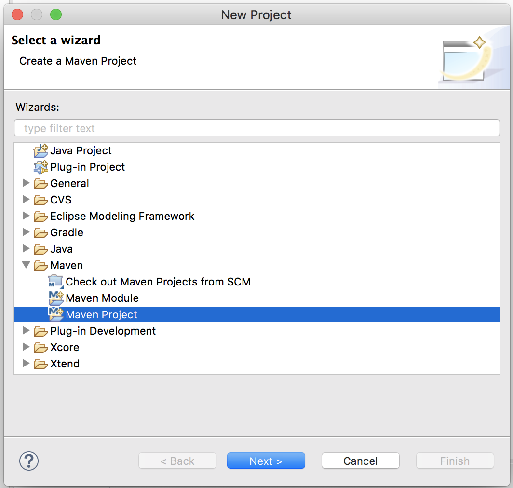
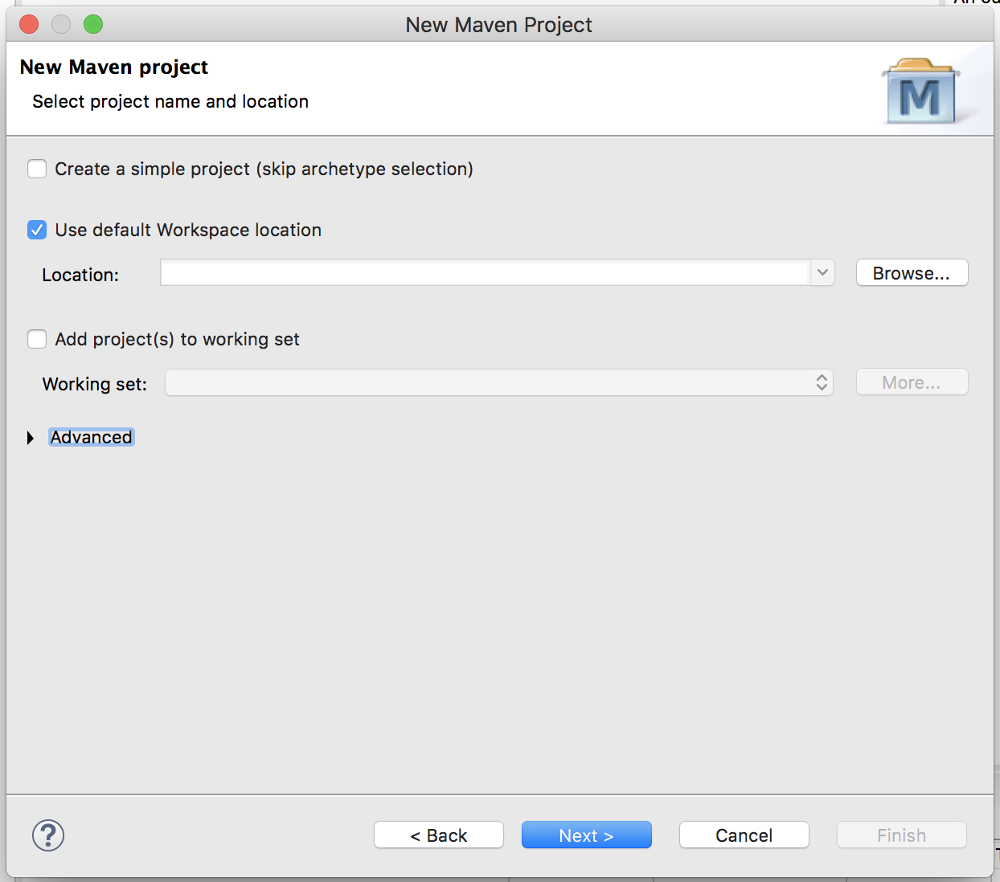
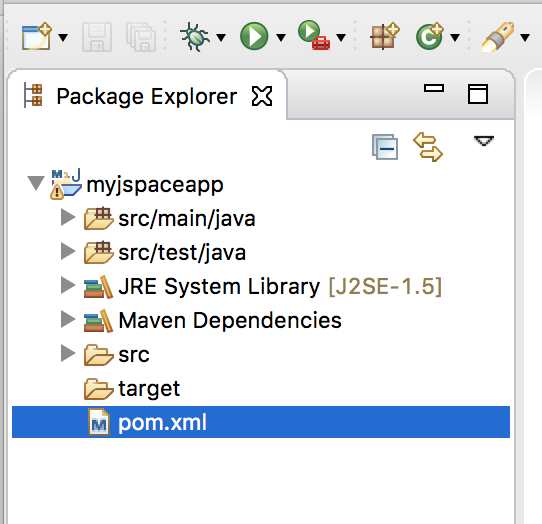
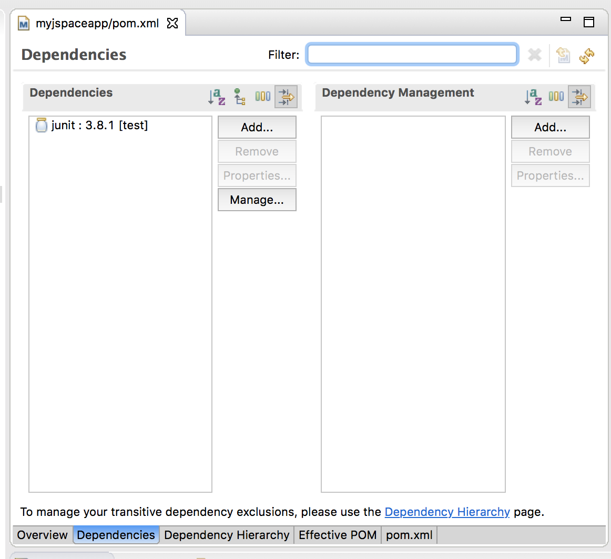
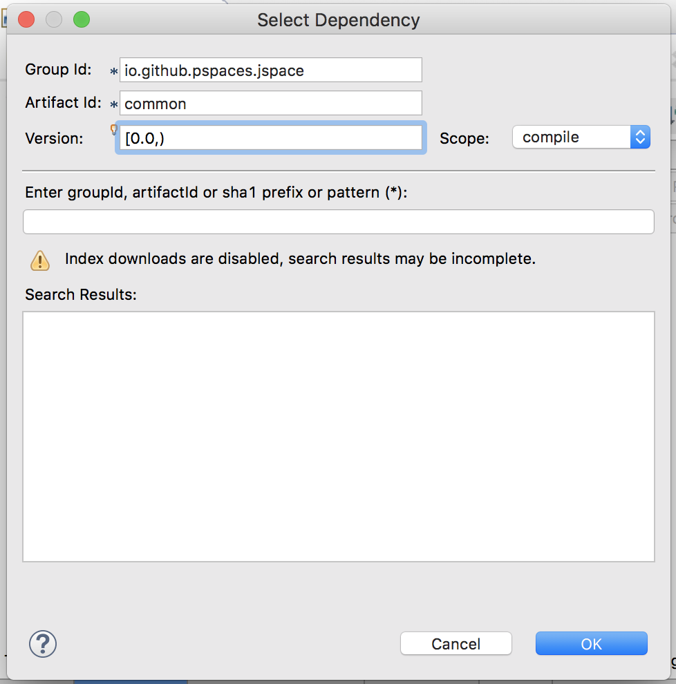
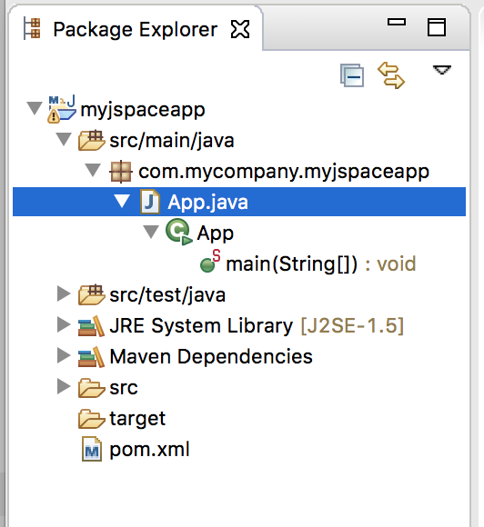
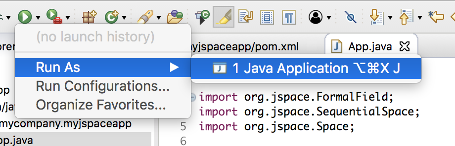

# Your first jSpace applications (with Eclipse)
If you have successfully [built and installed](getting_started.md) you can use Eclipse to develop your first jSpace Application. In fact you will use Eclipse as an IDE and Maven to manage dependencies. 

Open Eclipse and select _File->New->Project_ menu:


Select _Maven->Maven Project_:



Leave the default parameters and click _Next_:



The skeleton of a Maven project is generated. Open ```pom.xml``` file to add the dependency to jSpace:



Select the tab _Dependencies_:



Press button _Add_ to include the reference to jSpace. This opena dialog that you can fill as follow:



You can now open the file _App.java_ to code your first jSpace App:



Add the following code:

```
package com.mycompany.myjspaceapp;

import org.jspace.FormalField;
import org.jspace.SequentialSpace;
import org.jspace.Space;

public class App {

	public static void main(String[] argv) throws InterruptedException {
		Space inbox = new SequentialSpace();

		inbox.put("Hello World!");
		Object[] tuple = inbox.get(new FormalField(String.class));				
		System.out.println(tuple[0]);

	}

}
```

At this point you can exectute your application:


